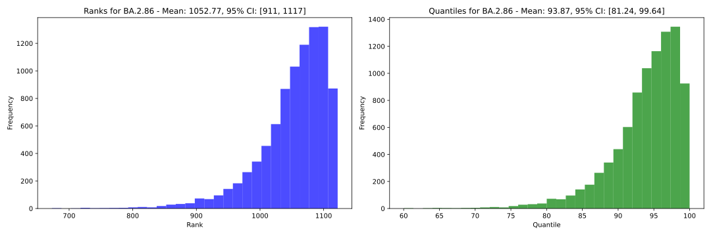

# Episodic 

A complete pipeline for fitting and testing Fixed Local Clock (FLC) molecular clock models for episodic evolution.

[](https://pypi.org/project/episodic)
[](https://pypi.org/project/episodic)

-----

# About

Episodic is a tool for fitting and testing Fixed Local Clock (FLC) molecular clock models for episodic evolution. The package is built on top of [SNK](https://snk.wytamma.com/), and provides a complete pipeline for fitting and testing models of episodic evolution using [BEAST](https://beast.community/).

Episodic implements the ideas of Tay et al. ([2022](https://pubmed.ncbi.nlm.nih.gov/35038741/) and [2023](https://academic.oup.com/mbe/article/40/10/msad212/7280106)) and detects episodic evolution through Bayesian inference of molecular clock models. 

Given a multiple sequence alignment and a list of groups to test for episodic evolution, episodic will:
- Configure BEAST analyses for strict, relaxed (UCGD) and fixed local clock models. 
- Configure marginal likelihood analyses for each clock model.
- Run all the BEAST and marginal likelihood analyses.
- Plot and summarise the results.
- Compute and plot Bayes factors for the marginal likelihood analyses.
- Produce maximum clade credibility (MCC) trees for each clock model.
- Compute bayes factor on effect size for the FLC models (foreground vs background).
- Run rank and quantile tests on the all the models.
- Handel the execution of the pipeline on a HPC cluster via snakemake profiles.
- Produce a report of the results (TBD).

## Features

- **Complete pipeline** - `episodic` provides a complete pipeline for fitting and testing FLC models of episodic evolution.
- **Flexible** - `episodic` is built on top of [SNK](https://snk.wytamma.com/), and provides a flexible framework for fitting and testing FLC models of episodic evolution.
- **Easy to use** - `episodic` is easy to use, and provides a simple interface for fitting and testing FLC models of episodic evolution.
- **robust** - `episodic` is robust, and provides a robust framework for fitting and testing FLC models of episodic evolution. 

## Installation

```console
pip install episodic
```

## CLI


## Outputs
Episodic will produce a range on log files, trees and plots. The following is a list of the main outputs.

- **BEAST log files** - `episodic` will produce a BEAST log file for each clock model. These files can be analysed with [Beastiary](https://beastiary.wytamma.com/).

- **BEAST trees** - `episodic` will produce a BEAST tree file for each clock model.
- **MCC trees** - `episodic` will produce a MCC tree for each clock model.
- **MCC tree plots** - `episodic` will produce a MCC tree plot for each clock model.

- **Marginal likelihoods** - `episodic` will produce a marginal likelihood plot for each clock model.

- **Bayes factors on effect size** - `episodic` will calculate a Bayes factors on effect size for each local clock model. 
    |Rate Column|p_p|p_odds|pos_p|pos_odds|bf|
    |---|---|---|---|---|---|
    |BA.2.86.rate|0.5034996111543162|1.0140971134481986|1.0|inf|inf|
- **Rank and quantile tests** - `episodic` will produce a rank and quantile test plot for each clock model.


- **Clock rate plots** - `episodic` will produce a rate plot for each clock model.

 

## DAG


## License

`episodic` is distributed under the terms of the [MIT](https://spdx.org/licenses/MIT.html) license.
